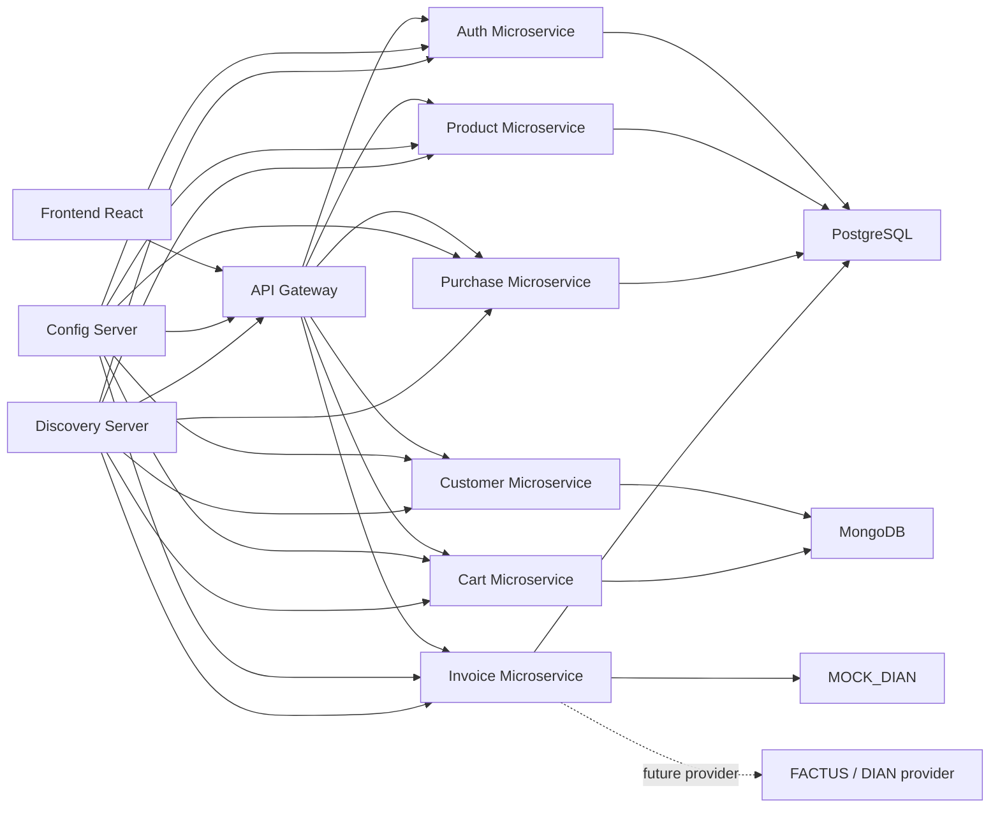
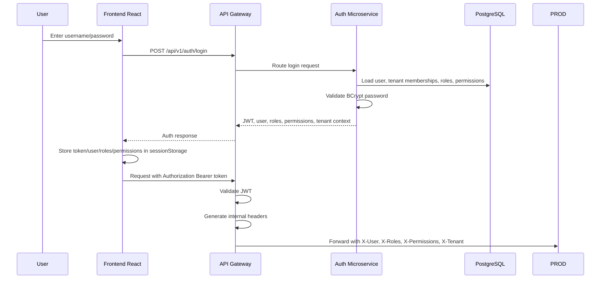
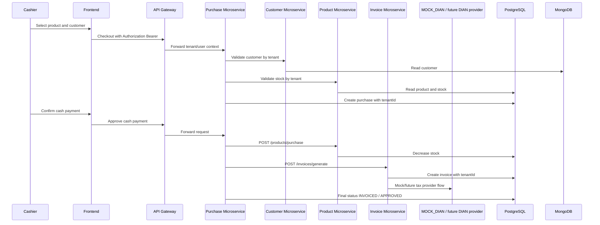
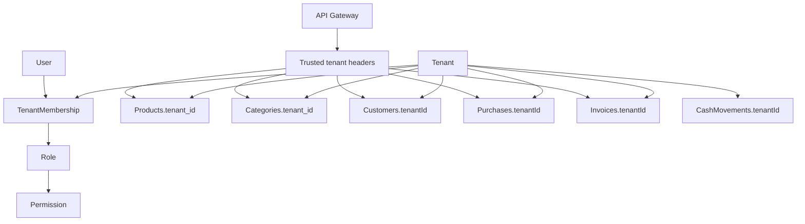
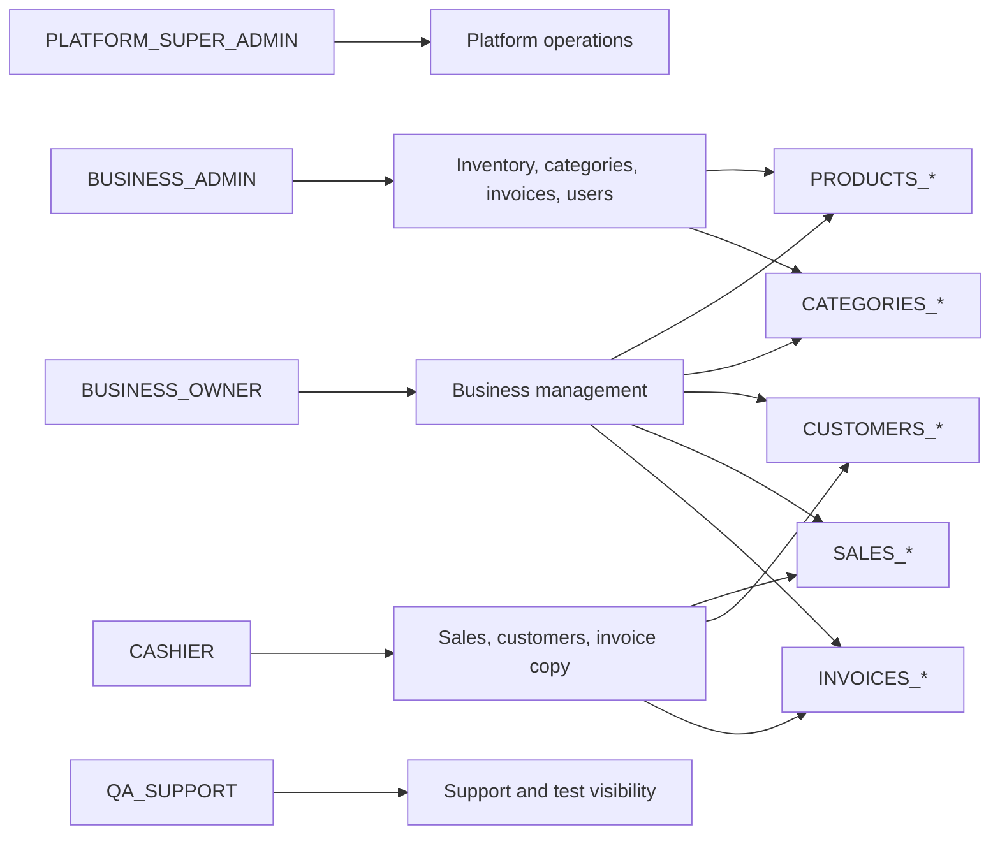

# RematePOS Architecture Diagrams

This document describes the current RematePOS architecture after the security, RBAC, tenant isolation and smoke validation work.

## 1. General Architecture

## 2. Login and JWT Flow

Gateway-generated internal headers:

- `X-User-Id`
- `X-Username`
- `X-Roles`
- `X-Permissions`
- `X-Tenant-Id`
- `X-Tenant-Slug`

The frontend only sends `Authorization: Bearer <token>`.

## 3. Sale and Invoice Flow

## 4. Multi-Tenant Model

Tenant isolation rule: user-facing queries must filter by tenant context. Old records without tenant data require backfill before they can appear in tenant-scoped results.

## 5. Roles and Permissions

Permission checks are enforced in microservices. Frontend menu visibility is a convenience layer, not a security boundary.
