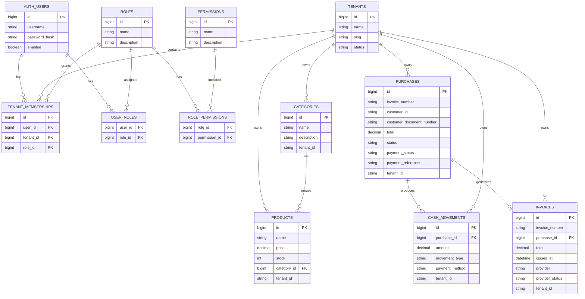
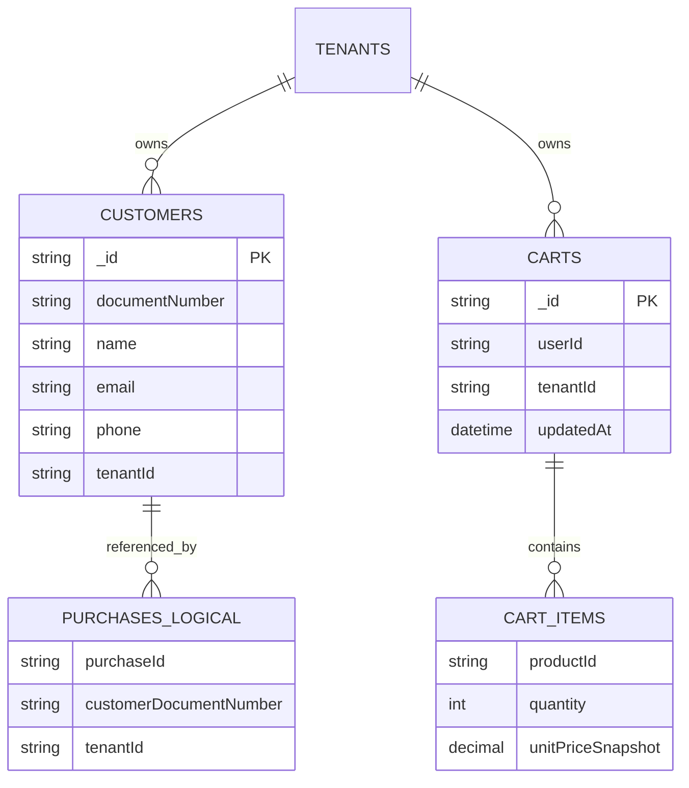

# RematePOS Database Diagrams

## PostgreSQL ER Diagram

## MongoDB Logical Diagram

MongoDB does not enforce SQL foreign keys. This diagram is logical and describes ownership and tenant isolation.

## Notes

- `tenant_id` and `tenantId` are nullable during the migration period.
- Backfill is required before old records become visible in tenant-scoped queries.
- Tenant-scoped unique constraints and indexes should be added as follow-up work.
